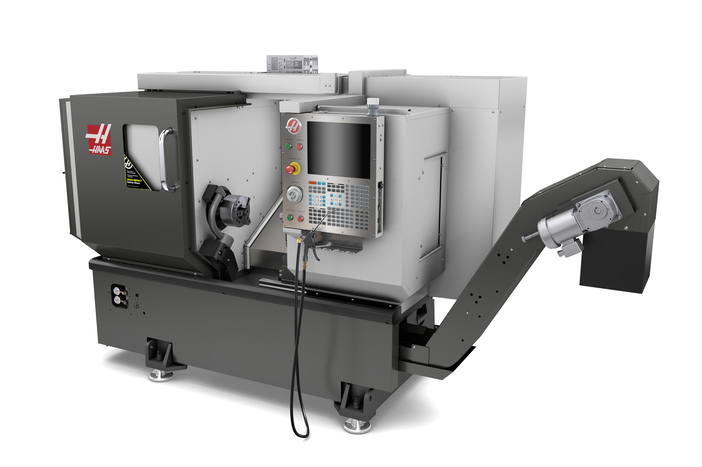
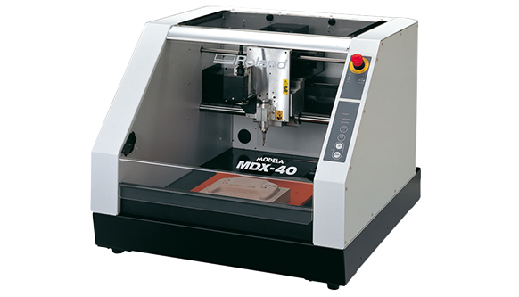
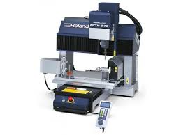
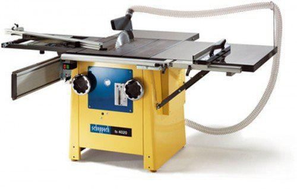
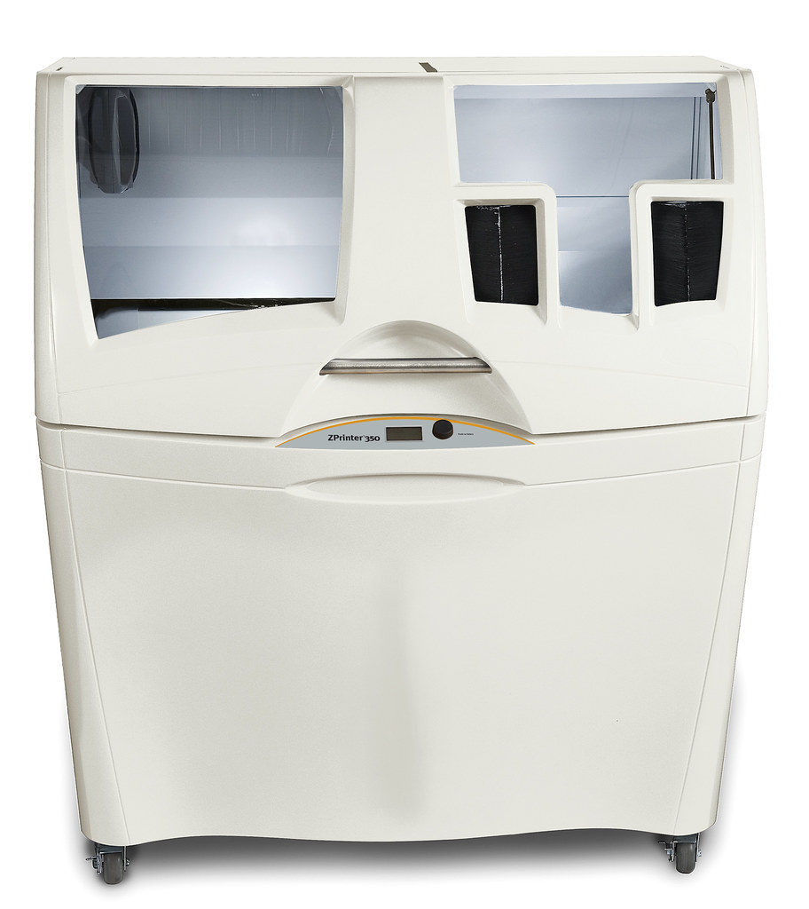
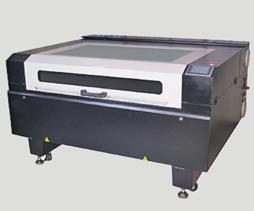
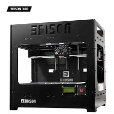
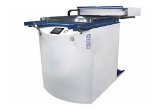
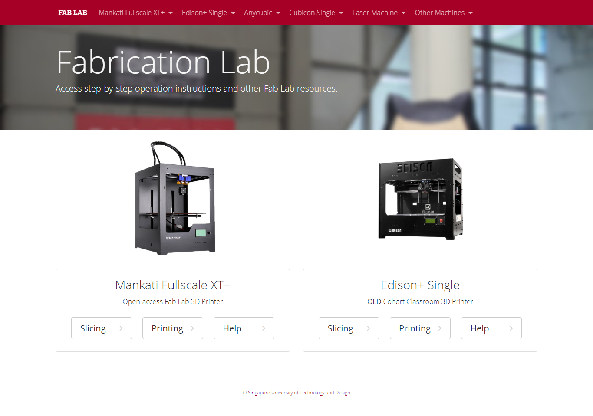

Adapted from: https://asd.sutd.edu.sg/about/facilities/fabrication-lab/

if you can do 3d printing and laser cutting only, kids and old people in singapore can do that too.. there are public programs at libraries that teach them how to 3D print. Find out about all the tools in the Fab Lab.

you are always welcome to use these machines, be sincere, to want to learn, to want to make things, and the staff will offer you help.

# Table of Contents

## Fab Lab in lists

- <a href="#equipment-list">Fab Lab equipment list</a>
- <a href="#equipment-list-unbolded">Fab Lab equipment list (unbolded)</a>
- <a href="#equipment-list-description">Fab Lab equipment list with description</a>
- <a href="#equipment-list-in-pictures">Fab Lab equipment list in pictures</a>

- <a href="#videos">Fab Lab equipment list in videos</a>

## Fab Lab things

- <a href="#websites-and sites-related-to-fab-lab-and-fabbing">Websites and sites related to fab lab and fabbing</a>
  - Fab Lab booking website; official SUTD fab lab website with instructions

<Where can I print things?>

<Where can I photocopy things?>

         

# Equipment list

**CNC Machine & Metal Shop**

1. HAAS ST-10 **CNC Lathe**
2. Roland MDX-40A 3D **Desktop Milling Machine**
3. Roland MDX-540 3D **Milling Machine**
4. US ShopBot **Desktop Router**
5. Zund G3 High Performance **Cutter**
6. Omax **Water Jet Cutter**
7. **Metal Shearing** Machine

**Woodwork Shop**

1. Scheppach TS 4020 **Circular Table Saw**
2. HAAS SR-100 **Gantry Sheet Router**
3. Griggio SNA 400 **Band Saw**
4. Griggio GSV13 **Vertical Panel Saw**
5. Maggi Big 800 **Radial Arm Saw**
6. Makita MLT100 **Table Saw**
7. **Belt Sanding** Machine
8. **Disc Sanding** Machine
9. **Bobbin Sander**

**Digital Fab Lab**

1. Stratasys **uPrint** **3D Printer**
2. Solido **SD300 Pro** **3D Printer**
3. Z Corporation **Zprinter 350**
4. Objet Connex350 **Multi-Material 3D Printing System**
5. LaserPro Spirit **Engraving**
6. Raytec RTW-100D **Large Format Laser Cutting System**
7. Universal Laser Systems PLS6.75
8. Edison **3D Desktop Printers**

**Maker Space 1 & 2**

1. KTK LG-13 **Manual Feed Drilling Machine**
2. Scheppach BTS 900x **Belt & Disc Sander**
3. Metabo BAS 260 **Swift Band Saw**
4. Formech 686 **Vacuum Former**
5. Proxxon **Scroll Saw**
6. Manix HCM-2S **Hotwire Foam Cutter**
7. Manix ABM-700 **Acrylic Bender**
8. Asahi Koki AF-35 **Scroll Saw**

# Equipment list (unbolded)

**CNC Machine & Metal Shop**

1. HAAS ST-10 CNC Lathe
2. Roland MDX-40A 3D Desktop Milling Machine
3. Roland MDX-540 3D Milling Machine
4. US ShopBot Desktop Router
5. Zund G3 High Performance Cutter
6. Omax Water Jet Cutter
7. Metal Shearing Machine

**Woodwork Shop**

1. Scheppach TS 4020 Circular Table Saw
2. HAAS SR-100 Gantry Sheet Router
3. Griggio SNA 400 Band Saw
4. Griggio GSV13 Vertical Panel Saw
5. Maggi Big 800 Radial Arm Saw
6. Makita MLT100 Table Saw
7. Belt Sanding Machine
8. Disc Sanding Machine
9. Bobbin Sander

**Digital Fab Lab**

1. Stratasys uPrint 3D Printer
2. Solido SD300 Pro 3D Printer
3. Z Corporation Zprinter 350
4. Objet Connex350 Multi-Material 3D Printing System
5. LaserPro Spirit Engraving
6. Raytec RTW-100D Large Format Laser Cutting System
7. Universal Laser Systems PLS6.75
8. Edison 3D Desktop Printers

**Maker Space 1 & 2**

1. KTK LG-13 Manual Feed Drilling Machine
2. Scheppach BTS 900x Belt & Disc Sander
3. Metabo BAS 260 Swift Band Saw
4. Formech 686 Vacuum Former
5. Proxxon Scroll Saw
6. Manix HCM-2S Hotwire Foam Cutter
7. Manix ABM-700 Acrylic Bender
8. Asahi Koki AF-35 Scroll Saw

# Equipment list (Description)

1. HAAS ST-10 **CNC Lathe**

   - Description

     A CNC (computer numerical control) machine that "shapes wood, metal, other materials by using a rotating drive which turns the piece being worked on against changeable cutting tools"

2. Roland MDX-40A **3D Desktop Milling Machine**

   - Description

     A machine that "cuts or shapes metal using a rotating tool"

3. Roland MDX-540 **3D Milling Machine**

   - Description

     A machine that "cuts or shapes metal using a rotating tool"

4. US ShopBot **Desktop Router**

   - Description

     "a power tool with a shaped cutter .. for making grooves"

5. Zund G3 **High Performance Cutter**

   - Description

     multipurpose cutter, router, etc

6. Omax **Water Jet Cutter**

   - Description

     Cut metals very deep (up to 15 cm or 6 inches) using a water jet

7. **Metal Shearing** Machine

   - Description

     basically cut sheet metals straight

**Woodwork Shop**

1. Scheppach TS 4020 **Circular Table Saw**

   - Description

     The famous Rotating Saw on a tabletop

2. HAAS SR-100 **Gantry Sheet Router**

   - Description

     Sheet wood CNC (computer numerical machine) router (machine that creates grooves)

3. Griggio SNA 400 **Band Saw**

   - Description

     Band saw.

4. Griggio GSV13 **Vertical Panel Saw**

   - Description

     panel saw

5. Maggi Big 800 **Radial Arm Saw**

   - Description

     Radial Arm Saw, can change angle, slide along one axis.

6. Makita MLT100 **Table Saw**

   - Description

     Rotating table saw

7. Belt **Sanding** Machine

   moves like a treadmill

8. Disc **Sanding** Machine

   Shaped like a disc and rotates on its center

9. Bobbin **Sander**

   - Description

     It bobs up and down while rotating on its axis

**Digital Fab Lab**

1. Stratasys uPrint 3D Printer

   - Description

     3D printer using FDM (standard 3D printing, fused deposition modeling)

     "The uPrint is a professional-grade printer designed for durability and demanding industrial use."

2. Solido SD300 Pro 3D Printer

   - Description

     Multi-color 3D printing

     "The SD300 uses Plastic Sheet Lamination technology to produce 3D objects:"

     > "The materials used in the SD300 Pro are a combination of PVC (PolyVinyl Chloride) and our own adhesive which results in rugged yet inexpensive models. These models can be machined, drilled, finished and painted and show no distortion over time."

3. Z Corporation Zprinter 350

   - Description

     high end monochrome 3D printer using powder and binder.

     "the world's first automated, monochrome 3D printer and the company's most affordable automated 3D printer to date"

     "Unlike other monochrome 3D printers, the ZPrinter 350 delivers high-end functionality such as:

     - automatic material loading
     - snap-in binder cartridges
     - integrated recycling of unused build material
     - self-monitoring operation
     - control from both the desktop and printer
     - 0.8 in/hour (20 mm/hour) vertical build speed
     - 8 x 10 x 8 in (203 x 254 x 203 mm) build size
     - 300 x 450 dpi resolution
     - office-safe build materials, aggressive dust-control, and zero liquid waste"

     The ZPrinter 350 also shares the advantages of the entire ZPrinter line, including:

     - Industry's lowest operating costs - one-fifth that of other technologies
     - Fastest print speed - produces prototypes five to 10 times faster than all other systems
     - Breakthrough ease of use - performs most operations automatically
     - High throughput - easily prints multiple models simultaneously, providing the productivity that engineering departments and classrooms need
     - High resolution - enables the printing of complex geometries and intricate details
     - Safety and office compatibility - no cumbersome supports that must be cut or dissolved with toxic chemicals.

4. Objet Connex350 Multi-Material 3D Printing System

   - Description

     good materials, 10 color palettes, smooth finishing, rubbery materials. FDM printing

     "The Connex3 system was the first 3D printer in the world to simultaneously 3D print multiple colors and materials."

5. LaserPro Spirit Engraving

   - Description

     laser cutter

     "The GCC **LaserPro Spirit GLS Hybrid** is the flagship model of the award winning Spirit line of laser engravers."
     Work Area: 34 x 24 in. (860 x 610mm) Extendable to 38 x 24 in. (965 x 610 mm)

     https://www.laserprona.com/laser-systems-spirit-gls/

6. Raytec RTW-100D Large Format Laser Cutting System

   ​	http://www.raytec.com.sg/ProductRTShow.asp?Id=2

   ​	Video Unavailable

7. Universal Laser Systems PLS6.75

   - Description

     Free standing laser cutter system CO2 laser

     Processing area  32 x 18 in (813 x 457 mm)

     https://www.ulsinc.com/products/platforms/pls6-75

     - SmartPIN Auto Focus
     - SmartBOX - ventilation box with honeycomb table
     - SmartLID - open lid from rear 
     - Pass-Through - doors can be opened for "extremely long working pieces"
     - Reliable and Made in USA CO2 Lasers
     - QSM (Quality speed mode) - speedy while retaining high quality
     - Key Switch & Emergency System - safeguards machine from unauthorized use
     - SmartACT (reduces ramping process, increasing speed)
     - SmartLIGHT - internal light for easy viewing
     - Drag and Engrave
     - Programmable Origin - relocate origin to any location
     - DuraGuide - "Systematic and reliable motion system embedded with strong mechanical framework, reinforced Kevlar belts, and accurate servomotor control technology to deliver superb output quality under rapid movement."

8. Edison 3D Desktop Printers

   - Description

     Standard cheap 3D desktop printer

**Maker Space 1 & 2**

1. KTK LG-13 Manual Feed Drilling Machine

   Standard fablab driling machine

2. Scheppach BTS 900x Belt & Disc Sander

   Belt and disc type sander combined in one machine

3. Metabo BAS 260 Swift Band Saw

   "continuous, flexible blade that moves in a constant downward motion"

4. Formech 686 Vacuum Former

   create plastic molds with a vacuum sucking machine

5. Proxxon Scroll Saw

6. Manix HCM-2S Hotwire Foam Cutter

   cut styrofoam using a hot wire

7. Manix ABM-700 Acrylic Bender

   bend acrylic about a straight axis with heat

8. Asahi Koki AF-35 Scroll Saw

   "short, thin blades that move up and down"

   "limited in width and length of material they can cut"

Formiga 3D printer

- Description

  Selective Laser Sintering printing - layer by layer selective laser shooting at powder bed

  

# Equipment list in pictures

1. HAAS ST-10 **CNC** Lathe

   A CNC (computer numerical control) machine that "shapes wood, metal, other materials by using a rotating drive which turns the piece being worked on against changeable cutting tools"

2. Roland MDX-40A 3D Desktop Milling Machine

   A machine that "cuts or shapes metal using a rotating tool"

3. Roland MDX-540 3D Milling Machine

   A machine that "cuts or shapes metal using a rotating tool"

4. US ShopBot Desktop Router

   "a power tool with a shaped cutter .. for making grooves"

5. Zund G3 High Performance Cutter

   multipurpose cutter, router, etc

6. Omax Water Jet Cutter

   Cut metals very deep (up to 15 cm or 6 inches) using a water jet

7. Metal Shearing Machine

   basically cut sheet metals straight

**Woodwork Shop**

1. Scheppach TS 4020 Circular Table Saw

   Rotating Saw on a tabletop

   

2. HAAS SR-100 Gantry Sheet Router

   Sheet wood CNC (computer numerical machine) router (machine that creates grooves)

   

3. Griggio SNA 400 Band Saw

   

4. Griggio GSV13 Vertical Panel Saw

   

5. Maggi Big 800 Radial Arm Saw

   Radial Arm Saw, can change angle, slide along one axis.

   

6. Makita MLT100 Table Saw

   

7. Belt Sanding Machine

   

8. Disc Sanding Machine

   

9. Bobbin Sander

   

**Digital Fab Lab**

1. Stratasys uPrint 3D Printer

   3D printer using FDM (standard 3D printing, fused deposition modeling)

   "The uPrint is a professional-grade printer designed for durability and demanding industrial use."

   

2. Solido SD300 Pro 3D Printer

   Multi-color 3D printing

3. Z Corporation Zprinter 350

   high end monochrome 3D printer using powder and binder.

   "the world's first automated, monochrome 3D printer and the company's most affordable automated 3D printer to date"

4. Objet Connex350 Multi-Material 3D Printing System

   good materials, 10 color palettes, smooth finishing, rubbery materials. FDM printing

5. LaserPro Spirit Engraving

   laser cutter

6. Raytec RTW-100D Large Format Laser Cutting System

7. Universal Laser Systems PLS6.75

8. Edison 3D Desktop Printers

**Maker Space 1 & 2**

1. KTK LG-13 Manual Feed Drilling Machine

   

2. Scheppach BTS 900x Belt & Disc Sander

   

3. Metabo BAS 260 Swift Band Saw

   

4. Formech 686 Vacuum Former

   

5. Proxxon Scroll Saw

   

6. Manix HCM-2S Hotwire Foam Cutter

   

7. Manix ABM-700 Acrylic Bender

   

8. Asahi Koki AF-35 Scroll Saw

   

# Videos

To watch the videos below in embedded form (not supported on GitHub) , [open this page on Notion](https://www.notion.so/humblevillager/Fab-Lab-Machines-List-Use-c2feb1b576434884bf93d79a100d7d03) 

1. HAAS ST-10 **CNC Lathe**

   - Description

     A CNC (computer numerical control) machine that "shapes wood, metal, other materials by using a rotating drive which turns the piece being worked on against changeable cutting tools"

     

2. Roland MDX-40A **3D Desktop Milling Machine**

   - Description

     A machine that "cuts or shapes metal using a rotating tool"

     milling

     

     engraving

     

3. Roland MDX-540 **3D Milling Machine**

   - Description

     A machine that "cuts or shapes metal using a rotating tool"

     

4. US ShopBot **Desktop Router**

   - Description

     "a power tool with a shaped cutter .. for making grooves"

     woodworking

     

5. Zund G3 **High Performance Cutter**

   - Description

     multipurpose cutter, router, etc

     

6. Omax **Water Jet Cutter**

   - Description

     Cut metals very deep (up to 15 cm or 6 inches) using a water jet

     

7. **Metal Shearing** Machine

   - Description

     basically cut sheet metals straight

     

**Woodwork Shop**

1. Scheppach TS 4020 **Circular Table Saw**

   - Description

     The famous Rotating Saw on a tabletop

     

2. HAAS SR-100 **Gantry Sheet Router**

   - Description

     Sheet wood CNC (computer numerical machine) router (machine that creates grooves)

     

3. Griggio SNA 400 **Band Saw**

   - Description

     Band saw.

     Video is larger 700 series. See the difference in specs:

     https://huphong.com.sg/product/saw/saw-for-metal/band-saw/sna-series/

     

4. Griggio GSV13 **Vertical Panel Saw**

   - Description

     panel saw

     

5. Maggi Big 800 **Radial Arm Saw**

   - Description

     Radial Arm Saw, can change angle, slide along one axis.

     

6. Makita MLT100 **Table Saw**

   - Description

     Rotating table saw

     

7. Belt **Sanding** Machine

8. Disc **Sanding** Machine

9. Bobbin **Sander**

   - Description

     It bobs up and down while rotating on its axis

     

**Digital Fab Lab**

1. Stratasys uPrint 3D Printer

   - Description

     3D printer using FDM (standard 3D printing, fused deposition modeling)

     "The uPrint is a professional-grade printer designed for durability and demanding industrial use."

     

2. Solido SD300 Pro 3D Printer

   - Description

     Multi-color 3D printing

     "The SD300 uses Plastic Sheet Lamination technology to produce 3D objects:"

     > "The materials used in the SD300 Pro are a combination of PVC (PolyVinyl Chloride) and our own adhesive which results in rugged yet inexpensive models. These models can be machined, drilled, finished and painted and show no distortion over time."

     

     

3. Z Corporation Zprinter 350

   - Description

     high end monochrome 3D printer using powder and binder.

     "the world's first automated, monochrome 3D printer and the company's most affordable automated 3D printer to date"

     "Unlike other monochrome 3D printers, the ZPrinter 350 delivers high-end functionality such as:

     - automatic material loading
     - snap-in binder cartridges
     - integrated recycling of unused build material
     - self-monitoring operation
     - control from both the desktop and printer
     - 0.8 in/hour (20 mm/hour) vertical build speed
     - 8 x 10 x 8 in (203 x 254 x 203 mm) build size
     - 300 x 450 dpi resolution
     - office-safe build materials, aggressive dust-control, and zero liquid waste"

     

4. Objet Connex350 Multi-Material 3D Printing System

   - Description

     good materials, 10 color palettes, smooth finishing, rubbery materials. FDM printing

     "The Connex3 system was the first 3D printer in the world to simultaneously 3D print multiple colors and materials."

     

5. LaserPro Spirit Engraving

   - Description

     laser cutter

     "The GCC **LaserPro Spirit GLS Hybrid** is the flagship model of the award winning Spirit line of laser engravers."
     Work Area: 34 x 24 in. (860 x 610mm) Extendable to 38 x 24 in. (965 x 610 mm)

     https://www.laserprona.com/laser-systems-spirit-gls/

     

6. Raytec RTW-100D Large Format Laser Cutting System

   ​	http://www.raytec.com.sg/ProductRTShow.asp?Id=2

   ​	Video Unavailable

7. Universal Laser Systems PLS6.75

   - Description

     Free standing laser cutter system CO2 laser

     Processing area  32 x 18 in (813 x 457 mm)

     https://www.ulsinc.com/products/platforms/pls6-75

     

8. Edison 3D Desktop Printers

   - Description

     Standard cheap 3D desktop printer

     

**Maker Space 1 & 2**

1. KTK LG-13 Manual Feed Drilling Machine
2. Scheppach BTS 900x Belt & Disc Sander
3. Metabo BAS 260 Swift Band Saw
4. Formech 686 Vacuum Former
5. Proxxon Scroll Saw
6. Manix HCM-2S Hotwire Foam Cutter
7. Manix ABM-700 Acrylic Bender
8. Asahi Koki AF-35 Scroll Saw

Formiga 3D printer

- Description

  Selective Laser Sintering printing - layer by layer selective laser shooting at powder bed

  

# Websites and sites related to fab lab and fabbing

- [Fab Lab booking website](https://edbooking.sutd.edu.sg/fablabbooking/) (edbooking.sutd.edu.sg/fablabbooking)

- [Official SUTD Fab Lab website with instructions](https://bit.ly/sutdfablab) (bit.ly/sutdfablab)

  

- https://all3dp.com/ awesome blog about 3d printing

- [Awesome 3d printing filaments for different purposes](https://all3dp.com/1/3d-printer-filament-types-3d-printing-3d-filament/)

- [thingiverse](https://www.thingiverse.com/) nice website to find 3D models to print 

- [Singapore Supplier list](https://sutdapac-my.sharepoint.com/:x:/g/personal/epd_rep_sutd_edu_sg/ESRZQtGx71pLqurk7Gz4h14BJQLqnxSvOEfcbw034Q-o9g?e=Y7SAPT) (SUTD SharePoint; courtesy EPD people https://epd.opensutd.org)

